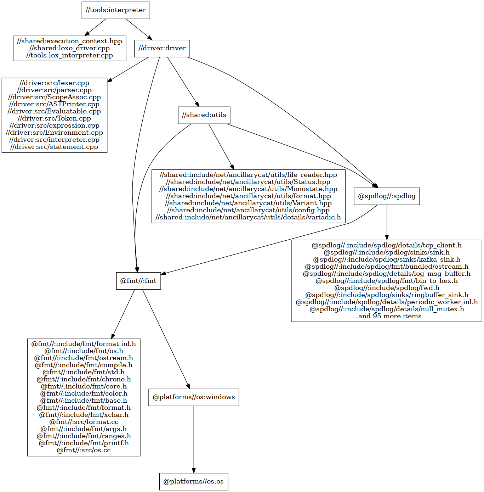

# Lox Interpreter written in C++

> my exercise for codecrafters' online judge repo see [here](https://github.com/LiAuTraver/codecrafters-interpreter-cpp); this is a more detailed version of my exercise's [codebase](https://github.com/LiAuTraver/loxo).

> from [Crafting Interpreters](http://www.craftinginterpreters.com/appendix-i.html)

## Build

A C++23 compiler is required to build the project; tested with gcc, clang, and MSVC. Bazel or CMake is required to build the project.

### Debug mode

#### with Bazel(currently only configured for Windows)
```powershell
bazel build //tools:interpreter # build the interpreter
bazel test //tests:... # run the tests
```

#### with CMake
vcpkg is required to install the dependencies.
Make sure the option `AC_CPP_DEBUG` is set to `ON` in the CMakeLists.txt file.
```powershell
cmake --preset= # see available presets, make sure to alter the toolchain file
```

### Release mode
No external dependencies are required for release mode. 
You can run Bazel or CMake as mentioned above(only for target `interpreter`),
or run the `run.sh` script in the root directory(Linux).

## Run

### Run the interpreter
by default the interpreter will output nothing in debug mode but only spdlog messages. comment the code in [execution_context.hpp, line 148-151](shared/execution_context.hpp) to see the output.
```powershell
interpreter tokenize <source>
interpreter parse <source>
interpreter evaluate <source>
interpreter run <source>
# repl was on the way, but not in a forseeable future...
```

## Grammar

### Syntax
```cpp
program        → declaration* EOF ;
```

### Declaration
```cpp
declaration    -> varDecl
                | statement
                | funcDecl 
                | classDecl ;

varDecl        -> "var" IDENTIFIER ( "=" expression )? ";" ;
funcDecl   -> "fun" function ;
classDecl  -> "class" IDENTIFIER ( "{" function* "}" )? ;  
```

### Statement
```cpp
statement      -> exprStmt
                | printStmt
                | block
                | ifStmt
                | whileStmt
                | forStmt
                | returnStmt ;

exprStmt        -> expression ";" ;
printStmt       -> "print" expression ";" ;
block           -> "{" declaration* "}" ;
ifStmt          -> "if" "(" expression ")" statement ( "else" statement )? ;
whileStmt       -> "while" "(" expression ")" statement ;
forStmt         -> "for" "(" ( varDecl | exprStmt | ";" )
                           expression? ";"
                           expression? ")" statement ;
returnStmt      -> "return" expression? ";" ;
```

### Expression
```cpp
expression     -> assignment ;

assignment     -> IDENTIFIER "=" assignment
                | logic_or ;

logic_or       -> logic_and ( "or" logic_and )* ;
logic_and      -> equality ( "and" equality )* ; 
equality       -> comparison ( ( "!=" | "==" ) comparison )* ;
comparison     -> term ( ( ">" | ">=" | "<" | "<=" ) term )* ;
term           -> factor ( ( "-" | "+" ) factor )* ;
factor         -> unary ( ( "/" | "*" ) unary )* ;
unary          -> ( "!" | "-" ) unary
                | call ;
call           -> primary ( "(" arguments? ")" )* ;

primary        -> NUMBER | STRING | "true" | "false" | "nil"
                | "(" expression ")" | IDENTIFIER ;
```

### Miscellaneous
```cpp
arguments     -> expression ( "," expression )* ;
function      -> IDENTIFIER "(" parameters? ")" block ;
parameters    -> IDENTIFIER ( "," IDENTIFIER )* ;
alnums        -> [a-zA-Z0-9] 
               | [.!@#$%^&*()] 
               | [...] ;
```

### Lexical
```cpp
number        -> digit + ( "." digit + )? ;
string        -> "\"" + ([[alnums]])* + "\"" ;
identifier    -> [a-zA-Z_] + [a-zA-Z0-9_]* ;
```
> note: the `cpp` was just for syntax highlighting in vscode to make it look prettier than plain text.

## Project Structure

> generated by Bazel
## Notes
This exercise is still in active development, and I will be updating it as I progress through the book.

TODO(pirority from high to low)
- [x] Binding and resolving
- [ ] Desugar `for` statement(currently handles it saparately)
- [ ] Add `class` support
- [ ] JVM bytecode generation
- [ ] Add class inheritance support
- [ ] LLVM IR generation
- [ ] (may never realize 😂)Machine code generation(x86_64, risc-v)
