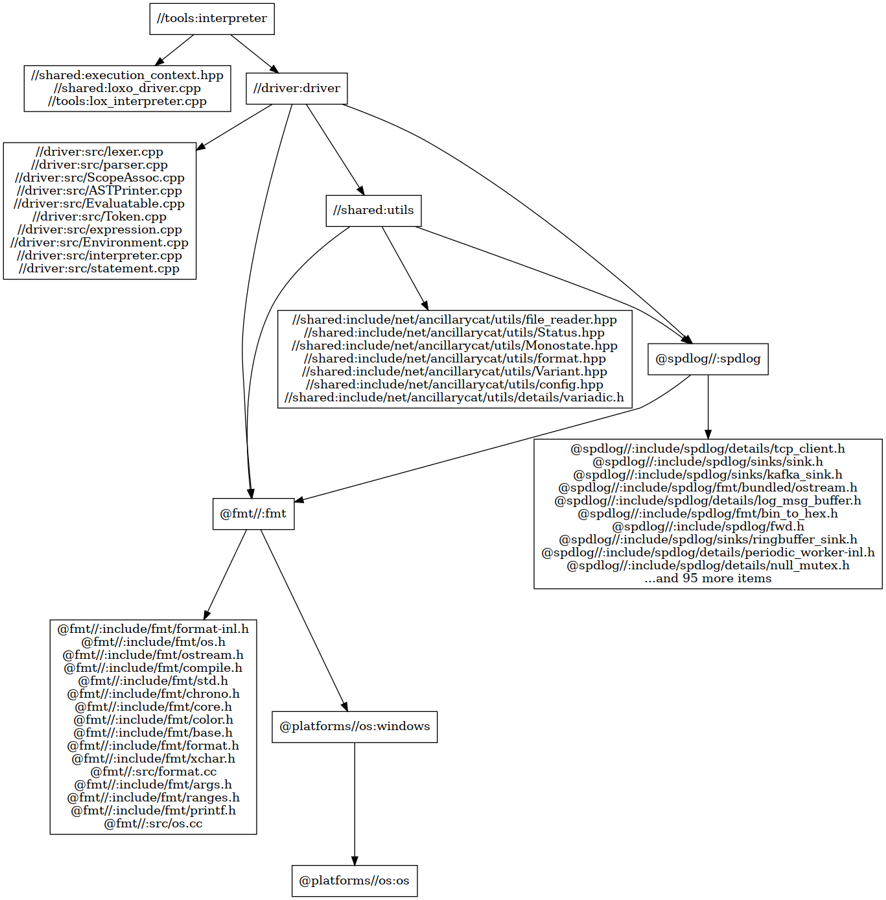

# Lox Interpreter written in C++

> my main repo see [here](https://github.com/LiAuTraver/loxo); this repo is exclusively for online judge in [codecrafters](https://codecrafters.io/)

> codecrafters' original `README` see below.


> from [Crafting Interpreters](http://www.craftinginterpreters.com/appendix-i.html)


## Project Structure

> generated by Bazel
## TODO
This exercise is still in active development, and I will be updating it as I progress through the book.
- [ ] Binding and resolving
- [ ] Add `class` support
- [ ] JVM bytecode generation
- [ ] Add class inheritance support
- [ ] LLVM IR generation
- [ ] (may never realize 😂)Machine code generation(x86_64, risc-v)


Original README
-------------------------------------------

[](https://app.codecrafters.io/users/codecrafters-bot?r=2qF)

This is a starting point for C++ solutions to the
["Build your own Interpreter" Challenge](https://app.codecrafters.io/courses/interpreter/overview).

This challenge follows the book
[Crafting Interpreters](https://craftinginterpreters.com/) by Robert Nystrom.

In this challenge you'll build an interpreter for
[Lox](https://craftinginterpreters.com/the-lox-language.html), a simple
scripting language. Along the way, you'll learn about tokenization, ASTs,
tree-walk interpreters and more.

Before starting this challenge, make sure you've read the "Welcome" part of the
book that contains these chapters:

- [Introduction](https://craftinginterpreters.com/introduction.html) (chapter 1)
- [A Map of the Territory](https://craftinginterpreters.com/a-map-of-the-territory.html)
  (chapter 2)
- [The Lox Language](https://craftinginterpreters.com/the-lox-language.html)
  (chapter 3)

These chapters don't involve writing code, so they won't be covered in this
challenge. This challenge will start from chapter 4,
[Scanning](https://craftinginterpreters.com/scanning.html).

**Note**: If you're viewing this repo on GitHub, head over to
[codecrafters.io](https://codecrafters.io) to try the challenge.

# Passing the first stage

The entry point for your program is in `src/main.cpp`. Study and uncomment the
relevant code, and push your changes to pass the first stage:

```sh
git commit -am "pass 1st stage" # any msg
git push origin master
```

Time to move on to the next stage!

# Stage 2 & beyond

Note: This section is for stages 2 and beyond.

1. Ensure you have `cmake` installed locally
2. Run `./your_program.sh` to run your program, which is implemented in
   `src/main.cpp`.
3. Commit your changes and run `git push origin master` to submit your solution
   to CodeCrafters. Test output will be streamed to your terminal.
